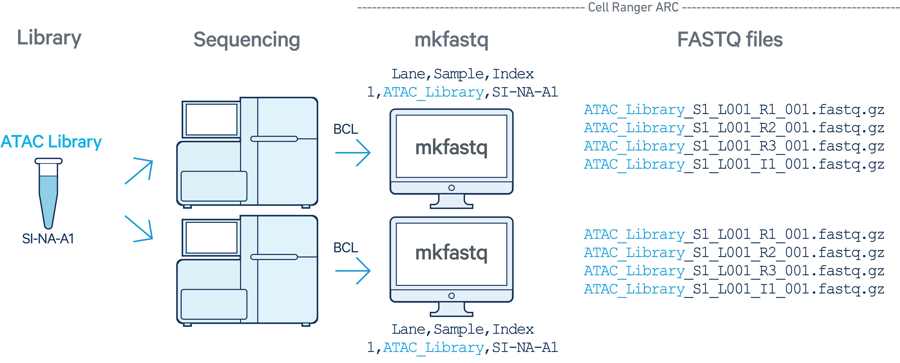

# Cell Ranger ARC for preprocessing sequencing data {#cellranger_arc}

Cell Ranger ARC is a set of analysis pipelines that process Chromium Single Cell Multiome ATAC + Gene Expression sequencing data to generate a variety of analyses pertaining to gene expression (GEX), chromatin accessibility, and their linkage. The pipeline includes base calling, sample demultiplexing, mapping, peak calling and read counting. You can refer to the complete instructions from 10x Genomics [here](https://www.10xgenomics.com/support/software/cell-ranger-arc/latest/analysis/running-pipelines/single-library-analysis).

> Note that the Cell Ranger ARC pipeline can only analyze Gene Expression and ATAC data together. It must not be used to analyze Gene Expression or ATAC alone. If scRNA-seq and scATAC-seq are generated from separate experiments, you should process them separately-- using [Cell Ranger](https://www.10xgenomics.com/support/software/cell-ranger/latest) for processing scRNA-seq and [Cell Ranger ATAC](https://support.10xgenomics.com/single-cell-atac/software/overview/welcome) for processing scATAC-seq.

The analysis involves the following steps:

* Step 1: Generate FASTQ files and perform demultiplexing by running `cellranger-arc mkfastq` on the Illumina `BCL`(base call files) output folder for each ATAC (GEX resp.) flow cell to generate ATAC (GEX resp.) FASTQ data. Note that a separate run of `mkfastq` is required for each ATAC and each GEX flow cell. \
* Step 2: Run a separate instance of `cellranger-arc count` for each GEM well that was demultiplexed by the `cellranger-arc mkfastq` in the previous step.

```{r echo=FALSE, fig.align = 'center', out.width = "100%", fig.cap = "The new SSA logo, which is actually a scatterplot, which is super neat!", }
knitr::include_graphics("images/gex-atac.png")
```

## BCL naming convention and CSV sample sheet

The Cell Ranger ARC pipeline starts with Illumina sequencer's base call files (BCLs), and converts them into FASTQ files using `cellranger-arc mkfastq`. Before we can run `cellranger-arc`, it is important to prepare a folder and CSV sample sheet for each flow cell, and ensure the samples are named in concordance with the BCL naming convention. (Please refer to the [bcl2fastq User Guide](https://support.illumina.com/content/dam/illumina-support/documents/documentation/software_documentation/bcl2fastq/bcl2fastq2-v2-20-software-guide-15051736-03.pdf) for complete instructions.)

An example of  eg. Sample_S1_L001_R1_001.fastq.gz. Briefly, FASTQ files taken by cellranger count are named with the sample name and number, the flow cell lane, and read. The file extension is '*.fastq.gz'. An example of FASTQ file name looks like this: samplename_S1_L001_R1_001.fastq.gz.

If the downloaded *.fastq.gz files are not in this naming convention, you will need to manually rename all files before you can call `cellranger count`.
Here is the explaination for each element in the name:

samplename: The name of the sample provided in the sample sheet. If a sample name is not available, the file name uses the sample ID instead.
S1: The number of the sample based on the order that samples are listed in the sample sheet, starting with 1.
L001: The lane number of the flow cell, starting with lane 1, to the number of lanes supported.
R1: The read index. R1 indicates Read 1. R2 indicates Read 2 of a paired-end run.
001: The last portion of the file name is always 001.
Special Note: L001 and L002 are indices of different Illumina sequencing lanes or batches, and we can use these indices as well as sample indices as means by which to distinguish treatment groups. If we want to analyze all samples in one treatment group together, they will be assigned the same sample number (e.g. S1) and different lane number (e.g. L001 and L002). (NOTE: Reads cannot be assigned as sample number 0 or lane number 0. If it has number 0, it will be excluded from downstream analysis.) For example, if there are 2 treatment groups each has 3 replicates, we will index all three replicates in group 1 as S1_L001, S1_L002, S1_L003 and replicates in group 2 as S2_L001, S2_L002 and S3_L003.


## `cellranger-arc mkfastq`

### Demultiplexing
The `cellranger-arc mkfastq` is a pipeline that wraps Illumina's bcl2fastq, while also supports demultiplexing of ATAC or Gene Expression (GEX) flow cells. For the demultiplexing purpose, the `cellranger-arc mkfastq` should be run for each flow cell separately, independent of the number of sequencing runs of each library. Below are two examples. 

In the first example, a library with sample index SI-NA-A1 was sequenced on two flow cells. The `cellranger-arc mkfastq` should be carried out for each flow cell. Next, the outputs will be processed though a single instance of `cellranger-arc count`.
```{r echo=FALSE, fig.align = 'center', out.width = "100%", fig.cap = "The new SSA logo, which is actually a scatterplot, which is super neat!", }

```

In the second example, two libraries (each processed through a separate GEM well with sample indices SI-TT-A1 and SI-TT-A2) are multiplexed on a single flow cell in one sequencing run. GEX Library 1 was processed on lane 1 and GEX Library 2 was processed on lane 2 of the same flow cell. A single `cellranger-arc mkfastq` should be carried out for this flow cell. 

```{r echo=FALSE, fig.align = 'center', out.width = "100%", fig.cap = "The new SSA logo, which is actually a scatterplot, which is super neat!", }
knitr::include_graphics("images/GEX-multiplex.png")
```


### Example codes

```{r eval=FALSE}
cellranger-arc mkfastq --id=tiny-bcl-atac \
                     --run=/path/to/tiny-bcl-atac \
                     --samplesheet=cellranger-arc-tiny-bcl-atac-samplesheet-1.0.0.csv


cellranger-arc mkfastq (2.0.2)
Copyright (c) 2020 10x Genomics, Inc.  All rights reserved.
-------------------------------------------------------------------------------


Martian Runtime - v4.0.5

...

Pipestance completed successfully!

yyyy-mm-dd hh:mm:ss Shutting down.
Saving pipestance info to "tiny-bcl-atac/tiny-bcl-atac.mri.tgz"

```


