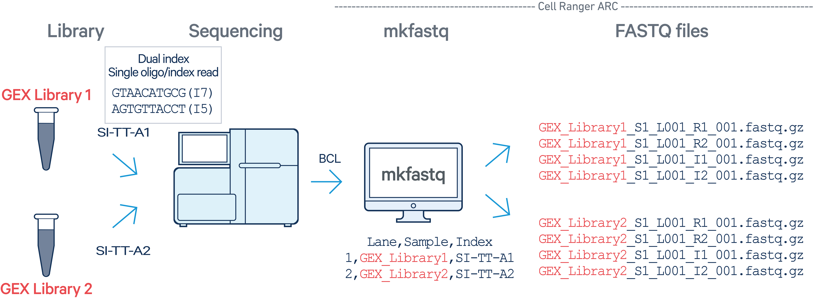

# Cell Ranger ARC for preprocessing sequencing data {#cellranger_arc}

Cell Ranger ARC is a set of analysis pipelines that process Chromium Single Cell Multiome ATAC + Gene Expression sequencing data to generate a variety of analyses pertaining to gene expression (GEX), chromatin accessibility, and their linkage. The pipeline includes base calling, sample demultiplexing, mapping, peak calling and read counting. You can refer to the complete instructions from 10x Genomics [here](https://www.10xgenomics.com/support/software/cell-ranger-arc/latest/analysis/running-pipelines/single-library-analysis).

> Note that the Cell Ranger ARC pipeline can only analyze Gene Expression and ATAC data together. It must not be used to analyze Gene Expression or ATAC alone. If scRNA-seq and scATAC-seq are generated from separate experiments, you should process them separately-- using [Cell Ranger](https://www.10xgenomics.com/support/software/cell-ranger/latest) for processing scRNA-seq and [Cell Ranger ATAC](https://support.10xgenomics.com/single-cell-atac/software/overview/welcome) for processing scATAC-seq.

The analysis involves the following steps:

* Step 1: Generate FASTQ files and perform demultiplexing by running `cellranger-arc mkfastq` on the Illumina `BCL`(base call files) output folder for each ATAC (GEX resp.) flow cell to generate ATAC (GEX resp.) FASTQ data. Note that a separate run of `mkfastq` is required for each ATAC and each GEX flow cell. \
* Step 2: Run a separate instance of `cellranger-arc count` for each GEM well that was demultiplexed by the `cellranger-arc mkfastq` in the previous step.

```{r echo=FALSE, fig.align = 'center', out.width = "100%", fig.cap = "The new SSA logo, which is actually a scatterplot, which is super neat!", }
knitr::include_graphics("images/gex-atac.png")
```

The FASTQ files are usually prepared by our sequencing core, so we can take the FASTQ files as input and call `callranger-arc count` to generate count matrices directly. 

::: {#note style="color: red;"}
`cellranger-arc` is already installed in HPC3 environment so we can call it directly using `module load`. You can check available software in HPC3 using `module avail`.
:::

## `cellranger-arc mkfastq`
::: {#note style="color: red;"}
Note: We won't run `cellranger-arc mkfastq` in this hands-on session, so this section below just shows an example for running the `mkfastq` pipeline. You can check the Cell Ranger website for detailed instructions for preparing input files for `mkfastq` run.
:::

The Cell Ranger ARC pipeline starts with Illumina sequencer's base call files (BCLs), and converts them into FASTQ files using `cellranger-arc mkfastq`. The `cellranger-arc mkfastq` is a pipeline that wraps Illumina's _bcl2fastq_, while also supports demultiplexing of ATAC or Gene Expression (GEX) flow cells. For the demultiplexing purpose, the `cellranger-arc mkfastq` should be run for each flow cell separately, independent of the number of sequencing runs of each library. Below are two examples. 

In the first example, a library with sample index SI-NA-A1 was sequenced on two flow cells. The `cellranger-arc mkfastq` should be carried out for each flow cell. Next, the outputs will be processed though a single instance of `cellranger-arc count`.

```{r echo=FALSE, fig.align = 'center', out.width = "100%", fig.cap = "The new SSA logo, which is actually a scatterplot, which is super neat!", }
knitr::include_graphics("images/ATAC-1.png")
```

In the second example, two libraries (each processed through a separate GEM well with sample indices SI-TT-A1 and SI-TT-A2) are multiplexed on a single flow cell in one sequencing run. GEX Library 1 was processed on lane 1 and GEX Library 2 was processed on lane 2 of the same flow cell. A single `cellranger-arc mkfastq` should be carried out for this flow cell. 

```{r echo=FALSE, fig.align = 'center', out.width = "100%", fig.cap = "The new SSA logo, which is actually a scatterplot, which is super neat!", }

```

For running `cellranger-arc mkfastq`, you will input a folder with BCL outputs from 10X machine, and a CSV sample sheet.

An example of the sample sheet is shown below.

```{bash eval=F}
$ cat cellranger-arc-test-bcl-atac-simple-1.0.0.csv
Lane,Sample,Index
1,test_sample_atac,SI-NA-A1

$ cat cellranger-arc-test-bcl-gex-simple-1.0.0.csv
Lane,Sample,Index
1,test_sample_gex,SI-TT-A1
```

The three columns are:

* Lane: Which lane(s) of the flow cell to process. Can be either a single lane, a range (e.g., 2-4) or '*' for all lanes in the flow cell.
* Sample: The name of the sample that you define.
* Index: 10x Genomics sample index that was used in library construction

***

Below is an example for running `cellranger-arc mkfastq` on one atac flow cell. You can specify the path to the BCL file and the CSV sample sheet in `--run` and `--csv` respectively.

```{text eval=F}
$ module load cellranger-arc
$ cellranger-arc mkfastq --id=test_bcl-atac \
                     --run=cellranger-arc-test-bcl-atac-1.0.0 \
                     --csv=cellranger-arc-test-bcl-atac-simple-1.0.0.csv

cellranger-arc mkfastq (2.0.2)
Copyright (c) 2020 10x Genomics, Inc.  All rights reserved.
-------------------------------------------------------------------------------


Martian Runtime - v4.0.5
Running preflight checks (please wait)...
yyyy-mm-dd hh:mm:ss [runtime] (ready)           ID.bcl-atac.MAKE_FASTQS_CS.MAKE_FASTQS.PREPARE_SAMPLESHEET
yyyy-mm-dd hh:mm:ss [runtime] (split_complete)  ID.bcl-atac.MAKE_FASTQS_CS.MAKE_FASTQS.PREPARE_SAMPLESHEET
yyyy-mm-dd hh:mm:ss [runtime] (run:local)       ID.bcl-atac.MAKE_FASTQS_CS.MAKE_FASTQS.PREPARE_SAMPLESHEET.fork0.chnk0.main
yyyy-mm-dd hh:mm:ss [runtime] (chunks_complete) ID.bcl-atac.MAKE_FASTQS_CS.MAKE_FASTQS.PREPARE_SAMPLESHEET
...

```

Once the `mkfastq` run is completed, you can find the output files in `outs/fastq_path`. 

```{bash eval=F}
$ ls -l test-bcl-atac/outs/fastq_path/
total 31744
drwxrwxr-x 3 jdoe jdoe       24 Sep  7 22:49 p1
drwxrwxr-x 3 jdoe jdoe       26 Sep  7 22:48 Reports
drwxrwxr-x 2 jdoe jdoe      193 Sep  7 22:48 Stats
-rw-rw-r-- 1 jdoe jdoe  3806257 Sep  7 22:48 Undetermined_S0_L001_I1_001.fastq.gz
-rw-rw-r-- 1 jdoe jdoe   967448 Sep  7 22:48 Undetermined_S0_L001_R1_001.fastq.gz
-rw-rw-r-- 1 jdoe jdoe  5773976 Sep  7 22:48 Undetermined_S0_L001_R2_001.fastq.gz
-rw-rw-r-- 1 jdoe jdoe 12635207 Sep  7 22:48 Undetermined_S0_L001_R3_001.fastq.gz

$ tree test-bcl-atac/outs/fastq_path/test-bcl-atac/
tiny-bcl-atac/outs/fastq_path/p1
└── s1
    ├── test_sample_miseq_S1_L001_I1_001.fastq.gz
    ├── test_sample_miseq_S1_L001_R1_001.fastq.gz
    ├── test_sample_miseq_S1_L001_R2_001.fastq.gz
    └── test_sample_miseq_S1_L001_R3_001.fastq.gz

```

***

## BCL naming convention
If you obtain the FASTQ files from other sources, it is important to ensure the FASTQ files are named in concordance with the BCL naming convention before running `cellranger-arc`. (Please refer to the [cellranger-arc input FASTQ files] (https://www.10xgenomics.com/support/software/cell-ranger-arc/latest/analysis/specifying-input-fastq-count) and [bcl2fastq User Guide](https://support.illumina.com/content/dam/illumina-support/documents/documentation/software_documentation/bcl2fastq/bcl2fastq2-v2-20-software-guide-15051736-03.pdf) for complete instructions.)


An example of the FASTQ file looks like this: `Sample_S1_L001_R1_001.fastq.gz`. Briefly, FASTQ files taken by are named with the sample name and number, the flow cell lane, and read. The file extension is '*.fastq.gz'.

If the downloaded *.fastq.gz files are not in this naming convention, you will need to manually rename all files before you can call `cellranger-arc count`.

Here is the explanation for each element in the name:

* samplename: The name of the sample provided in the sample sheet. If a sample name is not available, the file name uses the sample ID instead.
* S1: The number of the sample based on the order that samples are listed in the sample sheet, starting with 1.
* L001: The lane number of the flow cell, starting with lane 1, to the number of lanes supported.
* R1: The read index. R1 indicates Read 1. R2 indicates Read 2 of a paired-end run.
* 001: The last portion of the file name is always 001.
* Special Note: L001 and L002 are indices of different Illumina sequencing lanes or batches, and we can use these indices as well as sample indices as means by which to distinguish treatment groups. If we want to analyze all samples in one treatment group together, they will be assigned the same sample number (e.g. S1) and different lane number (e.g. L001 and L002). (NOTE: Reads cannot be assigned as sample number 0 or lane number 0. If it has number 0, it will be excluded from downstream analysis.) For example, if there are 2 treatment groups each has 3 replicates, we will index all three replicates in group 1 as S1_L001, S1_L002, S1_L003 and replicates in group 2 as S2_L001, S2_L002 and S3_L003.

***


## `cellranger-arc count`


```{bash eval=F}
fastqs,sample,library_type
/home/jdoe/fastq_path,example,Gene Expression
/home/jdoe/fastq_path,example,Chromatin Accessibility
```

The three columns are:

* fastqs: A path to the directory containing the demultiplexed FASTQ files for this sample. If you have multiple sets of fastqs for this library, add an additional row, and use the use same library_type value.
* sample: Sample name assigned as the Sample_ID in the demultiplexing sample sheet.
* library_type: This field is case-sensitive and must exactly match "Chromatin Accessibility" for a Multiome ATAC library and "Gene Expression" for a Multiome GEX library.


An example code:
```{bash eval=F}
$ cd /dfs6/pub/your_username
$ cellranger-arc count --id=Pancreas1 \
                       --reference=/home/jovyan/commondata/cellranger-arc/refdata-cellranger-arc-mm10-2020-A-2.0.0 \
                       --libraries=/dfs6/pub/dannil15/cellranger-arc/library.csv \
                       --localcores=8 \
                       --localmem=48
# takes about 6 hours for running one sample
```

The output folder structure looks like this:

```{bash eval=F}
Outputs:
      ...
- Run summary HTML:                              /home/jdoe/runs/sample345/outs/web_summary.html
- Run summary metrics CSV:                       /home/jdoe/runs/sample345/outs/summary.csv
- Per barcode summary metrics:                   /home/jdoe/runs/sample345/outs/per_barcode_metrics.csv
- Filtered feature barcode matrix MEX:           /home/jdoe/runs/sample345/outs/filtered_feature_bc_matrix
- Filtered feature barcode matrix HDF5:          /home/jdoe/runs/sample345/outs/filtered_feature_bc_matrix.h5
- Raw feature barcode matrix MEX:                /home/jdoe/runs/sample345/outs/raw_feature_bc_matrix
- Raw feature barcode matrix HDF5:               /home/jdoe/runs/sample345/outs/raw_feature_bc_matrix.h5
- Loupe browser visualization file:              /home/jdoe/runs/sample345/outs/cloupe.cloupe
- GEX Position-sorted alignments BAM:            /home/jdoe/runs/sample345/outs/gex_possorted_bam.bam
- GEX Position-sorted alignments BAM index:      /home/jdoe/runs/sample345/outs/gex_possorted_bam.bam.bai
- GEX Per molecule information file:             /home/jdoe/runs/sample345/outs/gex_molecule_info.h5
- ATAC Position-sorted alignments BAM:           /home/jdoe/runs/sample345/outs/atac_possorted_bam.bam
- ATAC Position-sorted alignments BAM index:     /home/jdoe/runs/sample345/outs/atac_possorted_bam.bam.bai
- ATAC Per fragment information file:            /home/jdoe/runs/sample345/outs/atac_fragments.tsv.gz
- ATAC Per fragment information index:           /home/jdoe/runs/sample345/outs/atac_fragments.tsv.gz.tbi
- ATAC peak locations:                           /home/jdoe/runs/sample345/outs/atac_peaks.bed
- ATAC smoothed transposition site track:        /home/jdoe/runs/sample345/outs/atac_cut_sites.bigwig
- ATAC peak annotations based on proximal genes: /home/jdoe/runs/sample345/outs/atac_peak_annotation.tsv

Waiting 6 seconds for UI to do final refresh.
Pipestance completed successfully!

yyyy-mm-dd hh:mm:ss Shutting down.

Saving pipestance info to "sample345/sample345.mri.tgz"

```

The outputs that are useful for next step include:

* web_summary.html: Run summary metrics and charts in HTML format.
* filtered_feature_bc_matrix.h5: Filtered feature barcode matrix stored in hdf5 format. The rows consist of all the gene and peak features concatenated together (identical to raw feature barcode matrix) and the columns are restricted to those barcodes that are identified as cells.
* filtered_feature_bc_matrix: Filtered feature barcode matrix stored in MEX format. The rows consist of all the gene and peak features concatenated together (identical to raw feature barcode matrix) and the columns are restricted to those barcodes that are identified as cells.
* atac_fragments.tsv.gz: Count and barcode information for every ATAC fragment observed in the experiment in TSV format.
* atac_fragments.tsv.gz.tbi: Index for atac_fragments.tsv.gz.


