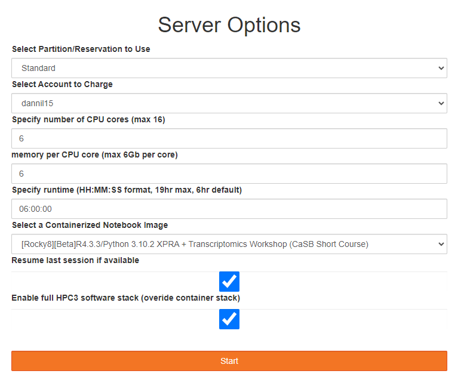

--- 
title: "Hands-on Analysis on Single Cell Multiome"
author: "Danni Liu"
date: "`r Sys.Date()`"
site: bookdown::bookdown_site
output: bookdown::gitbook
documentclass: book
bibliography: [book.bib, packages.bib]
biblio-style: apalike
link-citations: yes
github-repo: rstudio/bookdown-demo
description: "This is a minimal example of using the bookdown package to write a book. The output format for this example is bookdown::gitbook."
---

# Prerequisites

## About Data

The data used in this hands-on tutorial is a public single cell 'multiome' dataset of cryopreserved human peripheral blood mononuclear cells (PBMC) from 10x Genomics. This dataset is collected from a 25-year-old healthy female donor with around 10,000 cells, and scRNA-seq and scATAC-seq profiles were simultaneously sequenced from the same cells. You can find all information about this data and Cell Ranger ARC output reports from [10x Genomics website](https://support.10xgenomics.com/single-cell-multiome-atac-gex/datasets/1.0.0/pbmc_granulocyte_sorted_10k?). 

In this hands-on tutorial, we present a complete workflow for analyzing multiome data starting from sequencing data, with an additional section for data integration of multiomics datasets that are collected from different experiments. We will demonstrate how to preprocess raw sequencing data using Cell Ranger ARC, perform data quality control, cluster and annotate cell types, and identify marker genes using differential expression (DE) analysis. Then we will treat the two profiles of scRNA-seq and scATAC-seq as originating from two separate experiments, and perform data integration. Since they were originally measured in the same cells, this provides a ground truth that we can use to assess the accuracy of integration.


## Server environment requirements
We will use the UCI HPC3 environment for analysis. Please navigate to the [JypyterHub portal](https://hpc3.rcic.uci.edu/biojhub4/hub/login), and start a server under **the second option** with "R4.3.3" and "Spatial Transcriptomics" available in the environment. Please request **4 CPU cores**, with **6Gb of memory** for each core.

```{r echo=FALSE, fig.align = 'center', out.width = "100%", fig.cap = "JupyterHub server setting", }

```

Once the server started, click to open "Rstudio" app.

## R libraries

Please make sure to install the following packages before running the codes. `Seurat` and `SeuratData` should have installed in the environment if you are using HPC3 server.

```{r eval=FALSE}
# Enter commands in R (or R studio, if installed)
install.packages('Seurat')
library(Seurat)

install.packages("devtools")
library(devtools)
devtools::install_github('satijalab/seurat-data')

setRepositories(ind=1:3) # needed to automatically install Bioconductor dependencies
install.packages("Signac")

if (!requireNamespace("remotes", quietly = TRUE)) {
  install.packages("remotes")
}
remotes::install_github("mojaveazure/seurat-disk")

# Installing genome assembly and gene annotation packages
if (!require("BiocManager", quietly = TRUE))
    install.packages("BiocManager")
BiocManager::install(c('BSgenome.Hsapiens.UCSC.hg38', 'EnsDb.Hsapiens.v86'))

# install other packages needed.
install.packages("hdf5r")
BiocManager::install("biovizBase")
BiocManager::install("glmGamPoi")
install.packages("dplyr")
install.packages("clustree")
# install.packages("VariantAnnotation_1.50.0.tgz", repos = NULL, type="source")
```

If you want to run future analysis using your own laptop, please make sure you have the latest R and RStudio installed. You can refer to [RStudio website](https://posit.co/download/rstudio-desktop/) for installation instructions. 

* Seurat installation: https://satijalab.org/seurat/articles/install_v5
* Signac installation: https://stuartlab.org/signac/articles/install
* SeuratData installation: https://github.com/satijalab/seurat-data

## Construct folder structure

```{r eval=FALSE}
pwd # check the current directory
mkdir -p {~/cellranger_arc,~/pbmc_data} # create new folders
ls # list all files

```

## Downloading FASTQ files

We will practice using one pancreas sample with paired single cell GEX and ATAC from the same set of cells in this hands-on practice. You can download FASTQ files for GEX and ATAC using the following codes.

```{bash eval=F}


```


```{r include=FALSE}
# automatically create a bib database for R packages
knitr::write_bib(c(
  .packages(), 'bookdown', 'knitr', 'rmarkdown'
), 'packages.bib')
```
